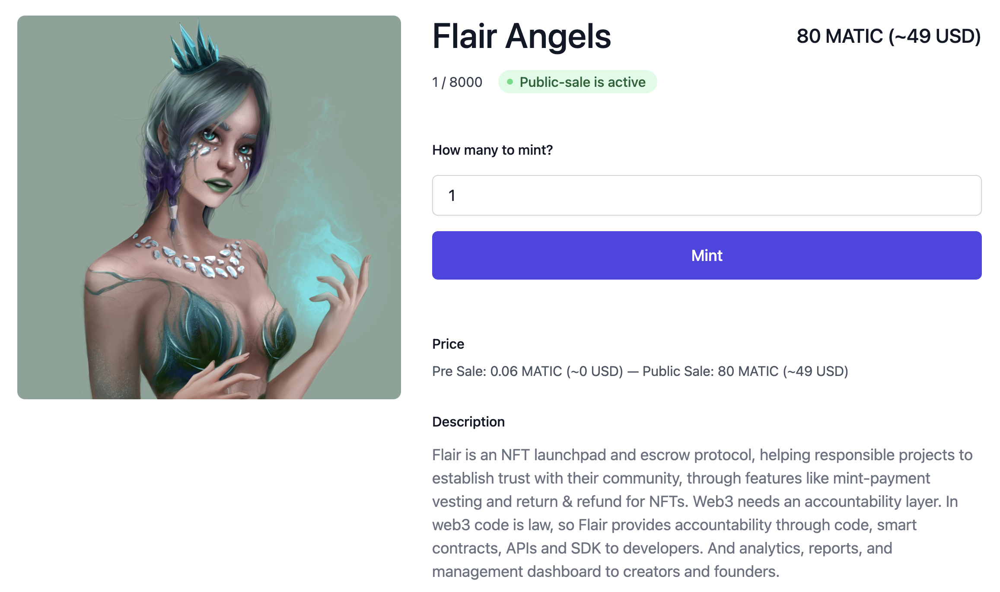

# Example: Custom NFT Minting Sales Page using React

This example React app renders a minting widget for an NFT collection deployed via [Flair's dashboard](https://app.flair.dev).

##### Dependencies

- `flair-sdk`: latest
- `react`: v17.x or v18.x

## :fire: Quick Start

1. Create a new NFT collection using [Flair's dashboard](https://app.flair.dev). Note that you will be the full owner of smart contract.
2. Clone the examples repo, install dependencies in the `custom-nft-minting-sales` directory:

   ```sh
   git clone https://github.com/flair-sdk/examples

   cd examples/react/custom-nft-minting-sales

   npm install
   ```

3. Grab your contract address and chain ID, and update [.env](./.env):
   - Set `REACT_APP_COLLECTION_CONTRACT_ADDRESS` to your deployed contract address you get from Flair's dashboard > Collections > your-collection > Deploy tab.
   - Set `REACT_APP_COLLECTION_CHAIN_ID` depending on the contract chain. Use `1` for Eth mainnet, `4` for Rinkeby testnet, `137` for Polygon mainnet, etc.
4. Run the react app in the `custom-nft-minting-sales` directory:

   ```sh
   npm start
   ```

5. Open [http://localhost:3000](http://localhost:3000) to view it in the browser.



## 🔮 Tutorial

To use this example within your app:

1. Install `flair-sdk` in your React app:

   ```sh
   npm install flair-sdk
   ```

2. Configure FlairProvider around your root App:

   ```ts
   import { FlairProvider } from "@flair-sdk/react";

   // ...
   <FlairProvider>
     <App />
   </FlairProvider>;
   // ...
   ```

3. Implement the minting widget depending on your preferred customizability:

   - Easiest approach with minimum customizability you can copy the code within [App.tsx](./src/App.tsx).
   - To have your own layout you can use individual components as in [TieredSalesMintingSection.tsx](https://github.com/flair-sdk/typescript/blob/main/packages/react/src/modules/finance/tiered-sales/sections/TieredSalesMintingSection.tsx)

4. _(optional)_ If you're using Webpack 5 (e.g. React v17+) you need to manually configure Buffer for Coinbase wallet to work:

   1. Install `npm install react-app-rewired buffer`
   2. Then create a [config-overrides.js](config-overrides.js) to inject the Buffer.

5. Profit :rocket:
