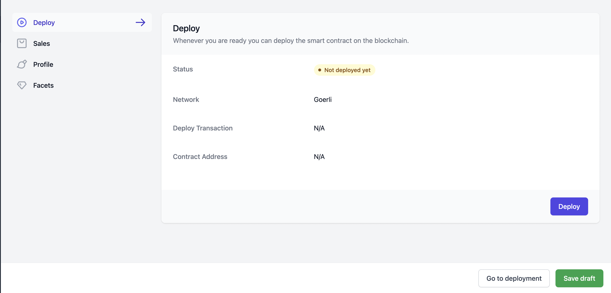
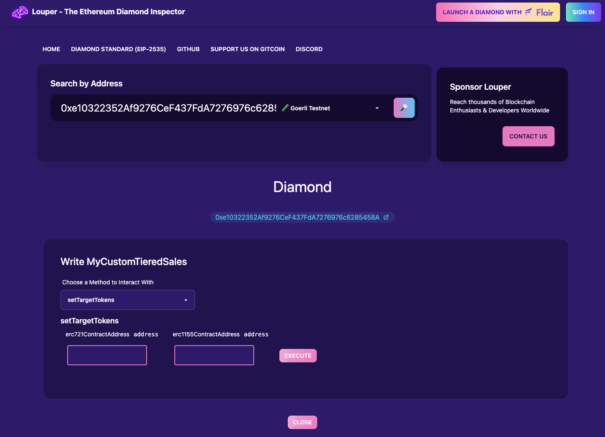
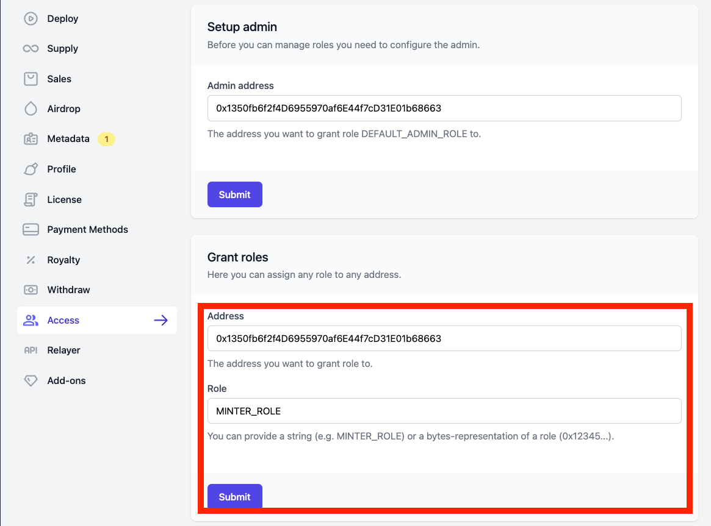
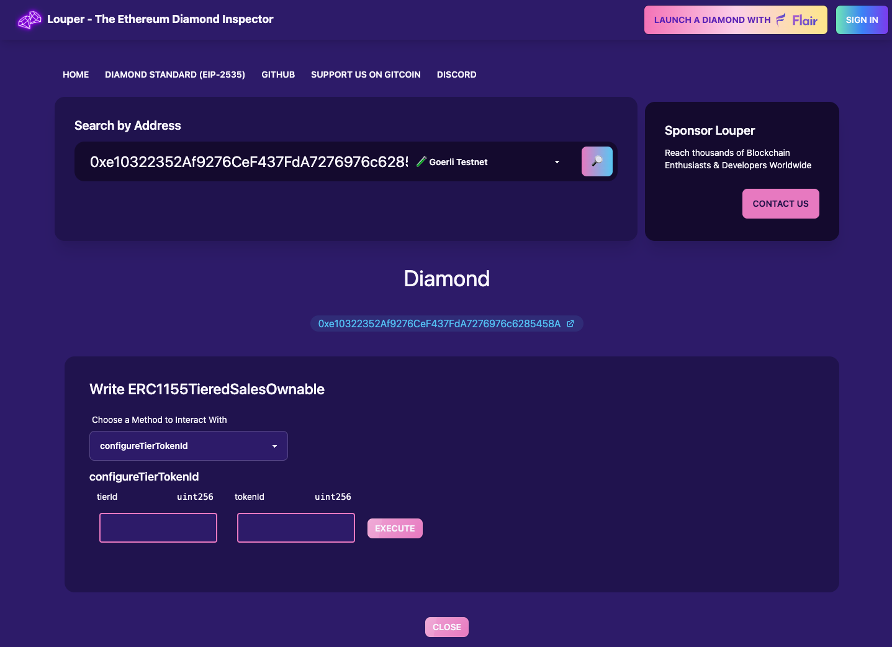

# Custom Tiered Sales Logic Contract

This repository shows how to create your **own custom sales logic** and take advantage of ready-made [Flair's Tiered Sales](https://app.flair.dev) mechanism.

In this example we create a simple small contract, then use Flair's existing "Tiered Sales" contracts, SDK and interfaces to add a custom logic:

- for our "mint" function e.g to call to 2 other NFT contracts (one ERC721 contract and one eRC1155) during mint (you need to deploy those two contracts separately and have their addresses at hand).
- to allow the same functionality but for users that want to pay with credit card or crypto

## Usage

1. Deploy our custom facet contract "MyCustomTieredSales", if not already done, so that `deployments` directory contains the address:

   ```bash
   npm run deploy:goerli
   ```

   - Remember this contract will be used as a [EIP-2535 Diamond](https://eips.ethereum.org/EIPS/eip-2535) facet.
   - If you need free test ETH on Goerli network visit [https://goerlifaucet.com](https://goerlifaucet.com)
   - This repository has already deployed the facet so you **don't need to re-deploy**, you can just use the existing address. Remember that in Diamond architecture facets only provide "code and logic" but the actual state is stored in the Diamond itself.

2. Generate the facet manifest (if there was a new deployment):

   ```bash
   npm run build
   ```

3. Go to Flair's dashboard and create an "Empty Diamond":

   

4. Import our custom facet object from [`src/facets.json`](./src/facets.json):

> :warning: Please double check that the first object property of facet object is `addresses`


5. Add ready-made `TieredSalesOwnable` facet which allows you to manage the tiers configs such as Price, Allocation, Allowlist, Start and End Dates etc.

   

Additionally, add these facets as well:

- [] Roles
- [] Roles - Admin
- [] ERC1155 - Tiered Sales - Admin - Ownable

6. Configure your tiers and the token you want to sell:

   

7. Save or deploy our diamond contract, which is responsible for our sales mechanism:

   

8. Configure our custom token addresses on our custom sales facet:

   Since we've introduced our custom contract (as a diamond facet) if we need to Read or Write to our custom functions we can use [Louper.dev](https://louper.dev/). Louper allows you to interact with a certain facet of a diamond contract.

   > :warning: Before interacting with Louper, you need to verify your cusom facets by running `npm run verify:goerli` inside this repo.

   You need to provide the address of your **newly deployed "Diamond"** to Louper (_not_ the facet code contract), and then find our custom facet **"MyCustomTieredSales"**, then click on "Write" button, to get to this interface below, where we select the functions and execute.

   

9. Grant MINTER_ROLE to our newly deployed Diamond on the 2 NFT token contacts (ERC721 and ERC1155):

   

10. If you need to specify which ERC1155 token id should be minted for a specific tier if in our custom sales contract, go to `write` section under `ERC1155TieredSalesOwnable` in Louper and configure it there:



## Upgrades

To upgrade your custom sales facet, you can re-deploy and just install the facet, basically to **repeat the step 1,2 and 4 above**. This simply replaces the old facet code with the new facet code (but keep the state as-is, since it is kept in the main Diamond contract itself).

The main consideration is if you're changing your storage "Layout" struct, you need to follow some general patterns which is described in:

- https://dev.to/mudgen/how-diamond-storage-works-90e
- https://eip2535diamonds.substack.com/p/keep-your-data-right-in-eip2535-diamonds

## Need Help?

Feel free to hop on our Discord, our developers are happy to help: https://discord.gg/flair
