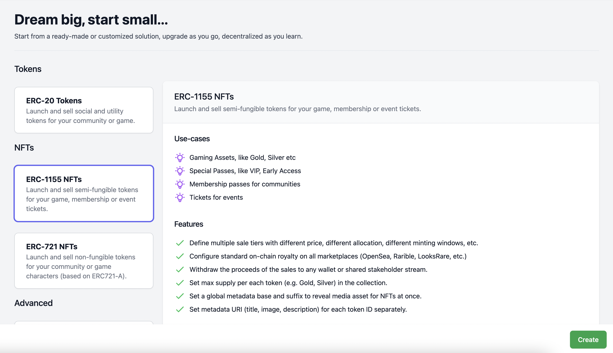
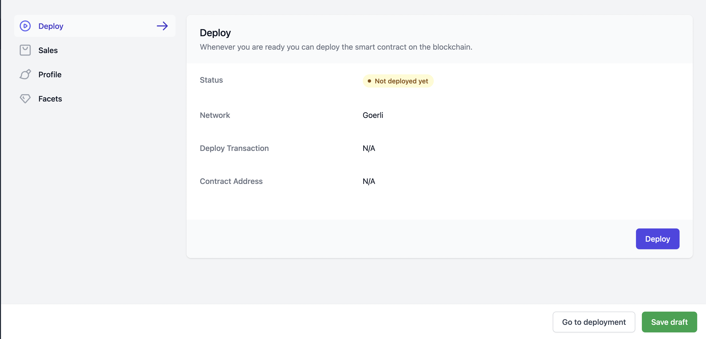
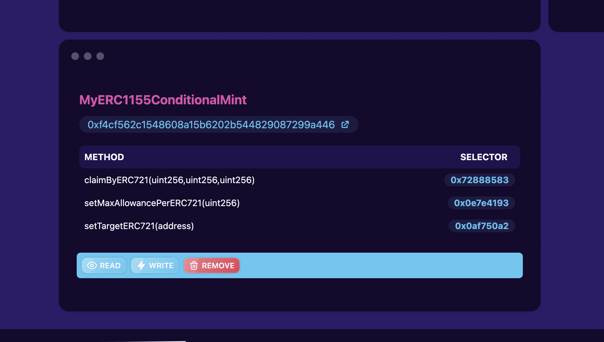

# Custom ERC1155 Conditional Mint

This repository shows how to create your **own custom minting logic** and take advantage of ready-made [Flair's diamond contract framework](https://app.flair.dev).

In this example we create a simple small add-on facet to use Flair's existing "ERC1155" mintable extension contract for our custom logic.

## Usage

1. Deploy our custom facet contract "MyERC1155ConditionalMint", if not already done, so that `deployments` directory contains the address:

   ```bash
   npm run deploy:goerli
   ```

   - Remember this contract will be used as a [EIP-2535 Diamond](https://eips.ethereum.org/EIPS/eip-2535) facet.
   - If you need free test ETH on Goerli network visit [https://goerlifaucet.com](https://goerlifaucet.com)
   - This repository has already deployed the facet so you **don't need to re-deploy**, you can just use the existing address. Remember that in Diamond architecture facets only provide "code and logic" but the actual state is stored in the Diamond itself.

2. Generate the facet manifest (if there was a new deployment):

   ```bash
   npm run build
   ```

3. Go to Flair's dashboard and create an "ERC1155" diamond:

   

4. Import our custom facet object from [`src/facets.json`](./src/facets.json):

> :warning: Please double check that the first object property of facet object is `addresses`


1. Save or deploy our diamond contract:

   

2. Configure our custom token address on our custom facet:

   Since we've introduced our custom contract (as a diamond facet) if we need to Read or Write to our custom functions we can use [Louper.dev](https://louper.dev/). Louper allows you to interact with a certain facet of a diamond contract.

   > :warning: Before interacting with Louper, you need to verify your custom facets by running `npm run verify:goerli` inside this repo.

   You need to provide the address of your **newly deployed "Diamond"** to Louper (_not_ the facet code contract), and then find our custom facet **"MyERC1155ConditionalMint"**, then click on "Write" button, to get to this interface below, where we select the functions and execute.

   

## Upgrades

To upgrade your custom sales facet, you can re-deploy and just install the facet, basically to **repeat the step 1,2 and 4 above**. This simply replaces the old facet code with the new facet code (but keep the state as-is, since it is kept in the main Diamond contract itself).

The main consideration is if you're changing your storage "Layout" struct, you need to follow some general patterns which is described in:

- https://dev.to/mudgen/how-diamond-storage-works-90e
- https://eip2535diamonds.substack.com/p/keep-your-data-right-in-eip2535-diamonds

## Need Help?

Feel free to hop on our Discord, our developers are happy to help: https://discord.gg/flair
